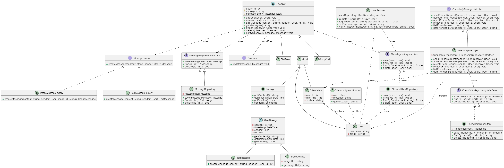

# LaravelChat

### Descrição do Projeto: LaravelChat

**LaravelChat** é um sistema de chat desenvolvido como parte de um portfólio, utilizando o framework Laravel. O projeto foi concebido com foco em boas práticas de desenvolvimento de software, aderindo aos princípios SOLID e aos padrões de design, garantindo modularidade, escalabilidade e manutenção simplificada.

#### **Funcionalidades Principais:**

1. **Sistema de Mensagens:**
    - Suporte para mensagens de texto e imagens, implementado por meio de um padrão de fábrica (`Factory Pattern`).
    - As mensagens são gerenciadas por um repositório que segue o padrão de repositório, permitindo que a camada de persistência seja facilmente modificada ou ampliada.
    - **Exemplo de Uso:** Envio e recebimento de mensagens de texto e imagens entre usuários.

2. **Sistema de Amizades:**
    - Implementação de um sistema robusto de amizades, onde os usuários podem enviar, aceitar, rejeitar e remover solicitações de amizade.
    - As amizades são representadas por uma entidade que conecta dois usuários, permitindo que cada amizade tenha um status (`pending`, `accepted`, `rejected`).
    - **Exemplo de Uso:** Gerenciamento de solicitações de amizade e visualização de status de amizade.

3. **Notificações em Tempo Real:**
    - Integração do padrão Observer para envio de notificações aos usuários quando novas mensagens são recebidas ou quando há alterações no status das amizades.
    - Possibilidade de adicionar diferentes tipos de notificações (e-mail, SMS, push notifications) através da implementação de uma interface `Notifier`.
    - **Exemplo de Uso:** Notificações em tempo real para novas mensagens e alterações de status de amizade.

4. **Gerenciamento de Usuários:**
    - Os usuários podem se registrar, fazer login e gerenciar seus perfis. O sistema utiliza repositórios para a persistência dos dados dos usuários, facilitando a gestão e a extensão futura.
    - **Exemplo de Uso:** Registro de novos usuários, login e gerenciamento de perfil.

5. **Design Modular e Extensível:**
    - Todas as funcionalidades foram projetadas com base em interfaces e classes abstratas, permitindo que o sistema seja facilmente escalável. Novas funcionalidades, como suporte para diferentes tipos de mensagens ou métodos de notificação, podem ser adicionadas sem a necessidade de modificar o código existente.
    - **Estrutura do Código:** O projeto é organizado em módulos separados para mensagens, usuários, amizades e notificações, seguindo princípios de design modular.

#### **Tecnologias Utilizadas:**

- **Laravel Framework:** A base do projeto, escolhida por sua robustez e facilidade de uso.
- **MySQL:** Para a persistência dos dados, incluindo mensagens, usuários e amizades.
- **PHP:** A linguagem de programação principal, com ênfase em princípios SOLID.
- **Composer:** Para gerenciamento de dependências.
- **Blade Templates:** Para renderização das interfaces do usuário.

#### **Público-Alvo e Finalidade:**

O **LaravelChat** é ideal para desenvolvedores que buscam um exemplo concreto de aplicação real, construído com foco em padrões de design e boas práticas. Este projeto serve como um forte exemplo de como um sistema de chat pode ser construído de maneira modular e extensível, sendo um destaque em qualquer portfólio profissional.

### **Objetivo do Projeto:**

O objetivo do **LaravelChat** é demonstrar a capacidade de criar um sistema completo e escalável, utilizando Laravel, que não apenas funcione bem, mas que seja também fácil de manter e expandir. Este projeto exemplifica a aplicação prática dos conceitos de design de software em um ambiente de produção realista, proporcionando um excelente exemplo de engenharia de software bem executada.

### Migrações do Banco de Dados

O projeto utiliza as seguintes migrações para configurar as tabelas no banco de dados:

- **`create_users_table.php`**: Migration para a tabela `users`.
- **`create_password_reset_tokens_table.php`**: Migration para a tabela `password_reset_tokens`.
- **`create_sessions_table.php`**: Migration para a tabela `sessions`.
- **`create_chat_rooms_table.php`**: Migration para a tabela `chat_rooms`.
- **`create_chat_room_user_table.php`**: Migration para a tabela `chat_room_user`.
- **`create_messages_table.php`**: Migration para a tabela `messages`.
- **`create_attachments_table.php`**: Migration para a tabela `attachments`.
- **`create_friendships_table.php`**: Migration para a tabela `friendships`.
- **`create_notifications_table.php`**: Migration para a tabela `notifications`.

Para aplicar essas migrações ao banco de dados, execute:

```bash
php artisan migrate
```
### Configuração do Banco de Dados

O projeto **LaravelChat** utiliza o banco de dados **MySQL**. Certifique-se de que o MySQL esteja instalado e configurado em seu ambiente.

- **Nome do Banco de Dados**: `chat`

Para configurar o banco de dados:

1. Crie um banco de dados no MySQL com o nome `chat`.
2. Configure as credenciais do banco de dados no arquivo `.env` do projeto, conforme o exemplo abaixo:

```env
DB_CONNECTION=mysql
DB_HOST=127.0.0.1
DB_PORT=3306
DB_DATABASE=chat
DB_USERNAME=seu_usuario
DB_PASSWORD=sua_senha
```
### Diagrama UML

O diagrama UML a seguir ilustra a arquitetura e o design do sistema **LaravelChat**. Ele fornece uma visão geral das principais classes e seus relacionamentos dentro do sistema.



### Gerenciamento de Usuários

#### **Classes e Repositórios:**

1. **`User`**
    - **Descrição:** Classe que representa um usuário do sistema. Gerencia informações como nome, e-mail e senha.
    - **Localização:** `app/Models/User.php`

2. **`UserRepositoryInterface`**
    - **Descrição:** Interface que define os métodos necessários para a manipulação dos dados dos usuários. Facilita a abstração e a implementação de diferentes fontes de dados.
    - **Localização:** `app/Repositories/UserRepositoryInterface.php`

3. **`EloquentUserRepository`**
    - **Descrição:** Implementação da interface `UserRepositoryInterface` usando Eloquent ORM. Fornece métodos para interagir com a tabela de usuários no banco de dados.
    - **Localização:** `app/Repositories/EloquentUserRepository.php`

4. **`UserService`**
    - **Descrição:** Serviço que contém a lógica de negócio relacionada aos usuários. Gerencia operações como registro, autenticação e atualização de perfil.
    - **Localização:** `app/Service/UserService.php`


    

### Sistema de Mensagens

#### **Classes e Interfaces:**

1. **`Message`**
    - **Descrição:** Classe concreta que estende `Model`. Representa uma mensagem enviada por um usuário no sistema, contendo informações como conteúdo, data/hora e remetente.
    - **Localização:** `app/Models/Message.php`

2. **`BaseMessage`**
    - **Descrição:** Classe abstrata que serve como base para diferentes tipos de mensagens. Contém propriedades comuns como conteúdo, timestamp e remetente.
    - **Localização:** `app/Messages/BaseMessage.php`

3. **`TextMessage`**
    - **Descrição:** Classe concreta que estende `BaseMessage`. Representa uma mensagem de texto no sistema.
    - **Localização:** `app/Messages/TextMessage.php`

4. **`TextMessageFactory`**
    - **Descrição:** Fábrica responsável por criar instâncias de `TextMessage`. Implementa a interface `MessageFactory`.
    - **Localização:** `app/Factories/TextMessageFactory.php`

5. **`MessageRepositoryInterface`**
    - **Descrição:** Interface que define os métodos necessários para a manipulação de mensagens. Facilita a abstração e a implementação de diferentes fontes de dados.
    - **Localização:** `app/Repositories/MessageRepositoryInterface.php`

6. **`MessageRepository`**
    - **Descrição:** Classe responsável pela manipulação e persistência de mensagens no banco de dados, implementando a interface `MessageRepositoryInterface`.
    - **Localização:** `app/Repositories/MessageRepository.php`


### Sistema de Amizades

#### **Classes e Interfaces:**

1. **`Friendship`**
    - **Descrição:** Classe que representa a relação de amizade entre dois usuários. Contém informações sobre os IDs dos usuários e o status da amizade.
    - **Localização:** `app/Models/Friendship.php`

2. **`FriendshipManagerInterface`**
    - **Descrição:** Interface que define os métodos necessários para gerenciar amizades entre usuários. Inclui operações como enviar, aceitar, rejeitar e remover pedidos de amizade.
    - **Localização:** `app/Contract/FriendshipManagerInterface.php`

3. **`FriendshipRepositoryInterface`**
    - **Descrição:** Interface que define os métodos necessários para a manipulação dos dados de amizades. Facilita a abstração e a implementação de diferentes fontes de dados.
    - **Localização:** `app/Contract/FriendshipRepositoryInterface.php`

4. **`FriendshipRepository`**
    - **Descrição:** Classe responsável pela manipulação e persistência das amizades no banco de dados, implementando a interface `FriendshipRepositoryInterface`.
    - **Localização:** `app/Repositories/FriendshipRepository.php`

5. **`FriendshipManage`**
    - **Descrição:** Serviço que contém a lógica de negócio relacionada à gestão de amizades. Gerencia operações como envio de pedidos de amizade, aceitação e remoção de amigos.
    - **Localização:** `app/Service/FriendshipManage.php`

